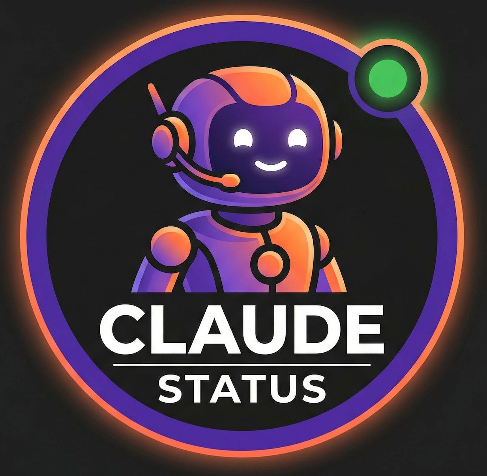

<p align="center">
  
  <h1 align="center">claude-status</h1>
  <p align="center">
    <strong>Real-time spending alerts for Claude Code. Know before you overspend.</strong>
  </p>
  <p align="center">
    <a href="https://github.com/oscarangulo/claude-status/releases"></a>
    <a href="https://github.com/oscarangulo/claude-status/actions"></a>
    <a href="LICENSE"></a>
  </p>
</p>

---

Claude Code doesn't tell you what you're spending *while* you're spending it. You find out at the end — after the damage is done.

**claude-status fixes that.** It monitors every tool call and warns you *inside your conversation* the moment something looks wrong: budget limits, stuck loops, context overflow, wrong model for the job.

```
[claude-status] BUDGET WARNING: Daily spend $16.40 is 82% of your $20 daily limit.
```

```
[claude-status] Loop detected: 4 failed Bash calls in a row.
               Consider explaining the issue instead of retrying.
```

```
[claude-status] Plan estimate: 5 tasks x $2.88 avg = ~$14.40. Budget remaining: $5.60.
               WARNING: This may exceed your remaining budget. Consider splitting into phases.
```

**No dashboard to check. No tab to switch to. Alerts come to you.**

---

## Install in 30 seconds

```bash
brew install claude-status
```

Restart Claude Code. Done.

> No Homebrew? See [other install options](#installation).

---

## What it catches

| Problem | What happens without claude-status | What happens with claude-status |
|---|---|---|
| **Runaway spending** | You check `/cost` and see $45 | Warned at 50%, 80%, and 100% of your budget |
| **Stuck loops** | Claude retries a failing command 10+ times | Alert after 3 failures: stop and rethink |
| **Context overflow** | Claude silently forgets early conversation | Warning at 80%, critical at 90% |
| **Wrong model** | Opus reads files at $5/M tokens | Suggestion to switch to Sonnet, save 70% |
| **Expensive session** | No pattern visibility across sessions | Alert when a session costs 2x your average |
| **Blind planning** | Start a 10-task plan with no cost idea | Estimate upfront: "10 tasks x $2.88 = ~$28.80" |
| **High burn rate** | Spending $0.50+/min without noticing | Alert to slow down and break work into pieces |
| **Expensive subagents** | No idea which agent cost how much | Per-agent cost breakdown: Explore $0.45, Plan $0.45 |
| **Stale context** | High context + idle = wasted tokens on restart | Prompt to start a fresh session |

---

## How alerts work

Every alert appears **as a system reminder inside your conversation**. Both you and Claude see it. Claude can react to it — for example, switching to a cheaper approach after a budget warning.

This works because claude-status uses Claude Code's `PostToolUse` hooks, which run after every tool call. There's no polling, no background process, and no data leaves your machine.

### Works in every environment

Hooks are part of Claude Code's core engine, not the IDE. Alerts work identically in:

- **Claude Code CLI** (terminal)
- **VS Code** (Claude Code extension)
- **Cursor**
- **JetBrains** (IntelliJ, WebStorm, etc.)

If Claude Code runs there, claude-status works there.

---

## Alert reference

### 1. Budget alerts

Set a daily limit. Get warned at three thresholds.

```bash
claude-status budget 20         # alerts at $10, $16, and $20
claude-status budget --session 5  # per-session limit too
```

> `Budget update: $10.00 spent today (50% of $20 limit).`
>
> `BUDGET WARNING: Daily spend $16.40 is 82% of your $20 daily limit.`
>
> `BUDGET EXCEEDED: Daily spend $22.50 has passed your $20 limit.`

### 2. Loop detection

Three consecutive failures of the same tool trigger an alert. One stuck loop can easily cost $10+.

> `Loop detected: 4 failed Bash calls in a row. Consider explaining the issue instead of retrying.`

### 3. Context watchdog

Adapts to your model — Opus uses a 1M token window, Sonnet/Haiku use 200k. Thresholds fire at the right time regardless of model.

> `Context window at 80%. Consider using /compact soon.`
>
> `CONTEXT CRITICAL (92%): Use /compact NOW or risk losing conversation history.`

### 4. Burn rate warning

Detects unsustainable spending velocity.

> `High burn rate: $0.65/min. Consider breaking tasks into smaller pieces.`

### 5. Expensive session alert

Compares your current session against the average of your past sessions. Needs 3+ sessions for a baseline.

> `Expensive session: $12.40 is 2.0x your average ($6.20). Consider splitting into smaller tasks.`

### 6. Model downgrade suggestion

When Opus is doing lightweight work (reads, searches, globs), you're overpaying.

> `Light tasks detected (reads/searches). Consider using Sonnet for this work to save ~70% on costs.`

### 7. Idle context warning

High context usage + no activity for 10+ minutes = wasted tokens on the next message.

> `Context at 75% with 15min idle. Consider starting a new session to save tokens.`

### 8. Plan cost estimation

When Claude creates a plan with 3+ tasks, you get an instant cost estimate based on your historical average cost per task.

> `Plan estimate: 5 tasks x $2.88 avg = ~$14.40. Budget remaining: $25.60. This plan fits within your daily limit.`

> `Plan estimate: 8 tasks x $2.88 avg = ~$23.04. WARNING: This may exceed your remaining budget ($15.00). Consider splitting into phases or using Sonnet.`

Accuracy improves as you complete more tasks. Needs 2+ completed tasks for the first estimate.

### 9. Session pulse

A brief session summary appears every 3 tool calls so you always know where you stand.

**API mode** (pay-per-token):
> `Session: $4.50 spent, 32% context, $0.45/min.`

**Pro mode** (subscription — Pro/Max/Team):
> `Session: 3 tasks done, 245K tokens, 32% context, +120/-15 lines, 45min.`

Pro mode is the default — no configuration needed. If you use the API directly (pay-per-token), switch to API mode for cost tracking:

```bash
claude-status budget --plan api   # enable cost alerts
claude-status budget 20           # set $20/day limit
claude-status budget --pulse 5    # change pulse frequency (default: 3)
```

### 10. Subagent cost tracking

When Claude spawns subagents (Explore, Plan, general-purpose), each one's cost is tracked individually. See exactly where your tokens go.

> `Expensive subagent: Explore cost $3.45. Consider using Sonnet for this type of work.`

The TUI dashboard shows a breakdown:

```
Subagents (3)  Total: $1.2300
  ▸ Explore    $0.4500  Sonnet
  ▸ Explore    $0.3300  Sonnet
  ▸ Plan       $0.4500  Opus
```

---

## Spending reports

### Daily

```bash
claude-status report
```

```
  Daily Report — 2026-04-01

  Total spent:    $23.03
  Budget:         $20.00 (115% used)
  Sessions:       3
  Tasks:          8

  Avg cost/task:  $2.88
  Avg cost/sess:  $7.68
  Cache hit:      50%
```

### Weekly

```bash
claude-status report --week
```

```
  Day                Cost Sessions    Tasks
  ──────────────────────────────────────────
  Mon 03/31         $8.20        2        5
  Tue 04/01        $31.91        3       17
  Wed 04/02        $18.20        2        9
  Thu 04/03        $12.50        4       11
  Fri 04/04         $5.30        1        3
  ──────────────────────────────────────────
  Total:           $76.11   Avg/day: $15.22
```

### TUI dashboard

Run `claude-status` with no arguments for a live terminal dashboard:

- Budget progress bar with remaining amount
- Context window usage (model-aware)
- Token breakdown with cache hit rate
- Per-task cost when using plans
- Optimization tips

---

## Architecture

```
Claude Code tool call
       |
       v
snapshot-hook.sh runs (< 50ms)
       |
       v
Reads native session data, computes cost, checks 10 alert conditions
       |
       v
Threshold crossed?  -->  Alert injected into conversation
Nothing wrong?      -->  Silent, zero interruption
```

No background processes. No external API calls. All data stays in `~/.claude-status/`.

Three hooks handle everything:

| Hook | Role |
|------|------|
| **snapshot-hook.sh** | Reads session data, computes cost, runs all alert checks, outputs warnings |
| **task-hook.sh** | Tracks per-task cost and estimates plan cost when using TodoWrite |
| **subagent-hook.sh** | Calculates per-subagent cost from transcript on SubagentStop |
| **status-line.sh** | Rich status bar with cost, tokens, context, current task, and subagent count |

---

## Commands

| Command | What it does |
|---------|-------------|
| `claude-status` | Live TUI dashboard |
| `claude-status budget 20` | Set $20/day daily limit |
| `claude-status budget --session 5` | Set $5/session limit |
| `claude-status budget` | Show current budget |
| `claude-status budget 0` | Disable budget |
| `claude-status report` | Today's spending report |
| `claude-status report --week` | This week's spending report |
| `claude-status history` | All past sessions |
| `claude-status install` | Set up hooks (automatic with Homebrew) |
| `claude-status update` | Upgrade and refresh hooks |
| `claude-status uninstall` | Clean removal |

---

## Installation

### Option 1: Homebrew (recommended)

```bash
brew install claude-status
```

Hooks configure automatically. Just restart Claude Code.

### Option 2: Go install

```bash
go install github.com/oscarangulo/claude-status/cmd/claude-status@latest
claude-status install
```

### Option 3: Download binary

Grab the latest from [Releases](https://github.com/oscarangulo/claude-status/releases):

| OS | Architecture | Binary |
|----|-------------|--------|
| macOS | Apple Silicon (M1+) | `claude-status-darwin-arm64` |
| macOS | Intel | `claude-status-darwin-amd64` |
| Linux | x86_64 | `claude-status-linux-amd64` |
| Linux | ARM64 | `claude-status-linux-arm64` |
| Windows | x86_64 | `claude-status-windows-amd64.exe` |

```bash
curl -L https://github.com/oscarangulo/claude-status/releases/latest/download/claude-status-darwin-arm64 -o claude-status
chmod +x claude-status
./claude-status install
```

### Option 4: From source

```bash
git clone https://github.com/oscarangulo/claude-status.git
cd claude-status
make install
claude-status install
```

### Requirements

- [Claude Code](https://docs.anthropic.com/en/docs/claude-code)
- [jq](https://jqlang.github.io/jq/) (installed automatically with Homebrew)
- bash and awk (included in macOS, Linux, and Windows Git Bash)

---

## Pricing reference

Cost is computed using official Anthropic pricing (per million tokens):

| | Input | Output | Cache Read | Cache Write |
|---|---:|---:|---:|---:|
| **Opus 4.6** | $5.00 | $25.00 | $0.50 | $6.25 |
| **Sonnet 4.6** | $3.00 | $15.00 | $0.30 | $3.75 |
| **Haiku 4.5** | $1.00 | $5.00 | $0.10 | $1.25 |

Context window sizes used for percentage calculation:

| Model | Context Window |
|---|---:|
| **Opus 4.6** | 1,000,000 tokens |
| **Sonnet 4.6** | 200,000 tokens |
| **Haiku 4.5** | 200,000 tokens |

---

## FAQ

**Does it slow down Claude Code?**
No. Each hook runs in under 50ms. You won't notice it.

**Does it send my data anywhere?**
No. Everything stays in `~/.claude-status/`. Zero network calls.

**Does it work in VS Code?**
Yes. Alerts use `PostToolUse` hooks which work in CLI, VS Code, Cursor, and JetBrains.

**Does it work on Windows?**
Yes. The Go binary and hooks work on Windows with Git Bash or WSL. Install via `go install` or download the binary from Releases.

**Can I use it without setting a budget?**
Yes. Loop detection, context warnings, model suggestions, burn rate alerts, and plan estimation all work without a budget.

**How accurate is plan cost estimation?**
It uses your historical average cost per completed task. After 10+ tasks, estimates are typically within 20% of actual cost.

**How do I update?**
`claude-status update` or `brew upgrade claude-status`.

**How do I remove it?**
`claude-status uninstall` gives you options: remove hooks only, hooks + data, or everything.

---

## Contributing

See [CONTRIBUTING.md](CONTRIBUTING.md). Help wanted:

- Windows testing ([#3](https://github.com/oscarangulo/claude-status/issues/3))
- Per-subagent cost tracking ([#4](https://github.com/oscarangulo/claude-status/issues/4))

## License

[MIT](LICENSE)
